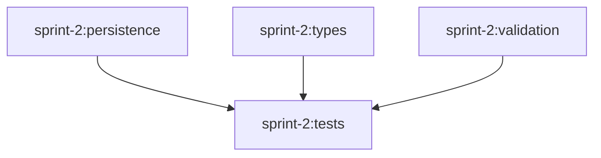

# Sprint Orchestration System

**Purpose**: Enable parallel development of sprint features using git worktrees, Turborepo, and Claude Code.

**Current Sprint**: Sprint 2 (Persistence & Basic Types)

---

## Architecture Overview

This orchestration system is designed to be **reusable across all sprints**. The structure is:

```
kitchen-sink/
├── package.json               # Root orchestration scripts (pattern: sprint-N, sprint-N:setup, sprint-N:task)
├── turbo.json                 # Turborepo task definitions with dependencies (uses //#task-name syntax for root tasks)
├── .orchestrator/             # Orchestration assets (not committed)
│   ├── prompts/               # Detailed task prompts (markdown)
│   │   ├── persistence.md
│   │   ├── types.md
│   │   ├── validation.md
│   │   └── tests.md
│   └── scripts/               # Shell scripts for common operations
│       ├── setup.sh           # Creates git worktrees
│       └── run-task.sh        # Generic task runner (takes task name as arg)
└── .worktrees/                # Git worktrees (created at runtime, not committed)
    ├── persistence/           # → sprint-N/persistence branch
    ├── types/                 # → sprint-N/types branch
    ├── validation/            # → sprint-N/validation branch
    └── tests/                 # → sprint-N/tests branch
```

**Files NOT committed** (in `.gitignore`):
- `.orchestrator/` - All orchestration assets
- `.worktrees/` - Git worktrees
- `package.json` - Orchestration scripts
- `turbo.json` - Task configuration

---

## Quick Start (Sprint 2)

Run everything with one command:

```bash
bun install
bun sprint-2
```

This will:
1. Create git worktrees for all 4 tasks
2. Run `persistence`, `types`, `validation` in **parallel**
3. Wait for all three to complete
4. Run `tests` with all dependencies available

## How It Works

The `bun sprint-2` command runs:
```bash
turbo run sprint-2:setup sprint-2:persistence sprint-2:types sprint-2:validation sprint-2:tests
```

**Execution flow:**
```
sprint-2:setup (creates worktrees via setup.sh)
    ↓
    ├─→ sprint-2:persistence (run-task.sh persistence) ──┐
    ├─→ sprint-2:types (run-task.sh types) ──────────────┼─→ sprint-2:tests (run-task.sh tests)
    └─→ sprint-2:validation (run-task.sh validation) ────┘
```

---

## Manual Execution

**Run individual tasks:**
```bash
bun run sprint-2:persistence
bun run sprint-2:types
bun run sprint-2:validation
bun run sprint-2:tests
```

**Run with turbo directly:**
```bash
turbo run sprint-2:persistence sprint-2:types sprint-2:validation
```

## Cargo Workspace Alignment

The orchestrator mirrors the Cargo workspace structure:

| Cargo Member | Git Branch | Worktree Path |
|--------------|------------|---------------|
| `crates/storage` | `sprint-2/persistence` | `.worktrees/persistence` |
| `crates/types` | `sprint-2/types` | `.worktrees/types` |
| `crates/validation` | `sprint-2/validation` | `.worktrees/validation` |
| `crates/tests` | `sprint-2/tests` | `.worktrees/tests` |

## Task Dependencies



- `persistence`, `types`, `validation` are independent and can run in parallel
- `tests` depends on all three completing

## Execution Flow

1. Turbo runs 3 parallel Claude Code instances
2. Each instance works in its own worktree
3. Changes committed to respective feature branches
4. After completion, merge feature branches into `sprint-2` base branch
5. Merge `sprint-2` into `main` (or `sprint-1` if applicable)

## Monitoring Progress

**List all worktrees:**
```bash
git worktree list
```

**Check branch status:**
```bash
git branch -vv
```

**View logs:**
```bash
# Turbo logs are in .turbo/runs/
ls -la .turbo/runs/
```

## Cleanup

**After sprint completion:**
```bash
# Remove worktrees
git worktree remove .worktrees/persistence
git worktree remove .worktrees/types
git worktree remove .worktrees/validation
git worktree remove .worktrees/tests

# Prune worktree metadata
git worktree prune

# Optional: Delete feature branches after merging
git branch -d sprint-2/persistence
git branch -d sprint-2/types
git branch -d sprint-2/validation
git branch -d sprint-2/tests
```

## Notes

- **Permission Mode**: Uses `--permission-mode=bypassPermissions` for non-interactive execution
- **Cache**: Disabled in turbo.json (cache: false) since each task is unique
- **Isolation**: Each worktree is completely isolated, preventing conflicts
- **Source of Truth**: Cargo.toml workspace members define the structure

## Troubleshooting

**Worktree already exists:**
```bash
git worktree remove .worktrees/persistence --force
```

**Branch conflicts:**
```bash
git branch -D sprint-2/persistence
```

**Reset everything:**
```bash
# Remove all worktrees
git worktree list | tail -n +2 | awk '{print $1}' | xargs -I {} git worktree remove {} --force

# Clean up branches
git branch | grep "sprint-2/" | xargs git branch -D

# Start fresh
```

---

## Setting Up Future Sprints

When preparing a new sprint (e.g., Sprint 3), follow this pattern:

### 1. Create Sprint Branch
```bash
git checkout -b sprint-3
```

### 2. Update Cargo Workspace
Edit `Cargo.toml` to add new workspace members based on sprint tasks:
```toml
[workspace]
members = [
    ".",
    "crates/indexing",
    "crates/queries",
    "crates/codegen",
]
```

### 3. Create Workspace Crate Stubs
```bash
mkdir -p crates/{indexing,queries,codegen}/src
# Create Cargo.toml for each
# Create src/lib.rs placeholders
```

### 4. Create Task Prompts
Create detailed markdown prompts in `.orchestrator/prompts/`:
```bash
.orchestrator/prompts/
├── indexing.md
├── queries.md
└── codegen.md
```

Each prompt should include:
- **Objective** - What this task accomplishes
- **Context** - Current state, dependencies
- **Requirements** - Detailed technical specifications
- **Success Criteria** - Checklist of deliverables
- **Implementation Notes** - Guidance and constraints
- **Dependencies** - External crates needed
- **Deliverables** - Expected files/modules

### 5. Update `package.json`
Add scripts following the pattern:
```json
{
  "scripts": {
    "sprint-3": "turbo run sprint-3:setup sprint-3:indexing sprint-3:queries sprint-3:codegen",
    "sprint-3:setup": ".orchestrator/scripts/setup.sh",
    "sprint-3:indexing": ".orchestrator/scripts/run-task.sh indexing",
    "sprint-3:queries": ".orchestrator/scripts/run-task.sh queries",
    "sprint-3:codegen": ".orchestrator/scripts/run-task.sh codegen"
  }
}
```

### 6. Update `turbo.json`
Define task dependencies using `//#` prefix for root tasks:
```json
{
  "tasks": {
    "//#sprint-3:setup": {
      "dependsOn": [],
      "cache": false
    },
    "//#sprint-3:indexing": {
      "dependsOn": ["//#sprint-3:setup"],
      "cache": false
    },
    "//#sprint-3:queries": {
      "dependsOn": ["//#sprint-3:setup"],
      "cache": false
    },
    "//#sprint-3:codegen": {
      "dependsOn": ["//#sprint-3:indexing", "//#sprint-3:queries"],
      "cache": false
    }
  }
}
```

### 7. Update Setup Script (if needed)
Modify `.orchestrator/scripts/setup.sh` to create appropriate worktrees:
```bash
#!/usr/bin/env bash
set -e

echo "Setting up Sprint 3 worktrees..."

git worktree add -b sprint-3/indexing .worktrees/indexing 2>/dev/null || echo "  ✓ indexing worktree exists"
git worktree add -b sprint-3/queries .worktrees/queries 2>/dev/null || echo "  ✓ queries worktree exists"
git worktree add -b sprint-3/codegen .worktrees/codegen 2>/dev/null || echo "  ✓ codegen worktree exists"

echo "✓ All worktrees ready"
```

### 8. Run the Sprint
```bash
bun install
bun sprint-3
```

---

## Design Principles for Sprints

**Key conventions to maintain:**

1. **Script Organization**:
   - All scripts in `.orchestrator/scripts/`
   - Use generic `run-task.sh` script with task name as parameter
   - One `setup.sh` per sprint pattern (can be reused with modifications)

2. **Package.json Pattern**:
   - Main command: `sprint-N` (runs entire pipeline)
   - Setup command: `sprint-N:setup` (creates worktrees)
   - Task commands: `sprint-N:task-name` (runs individual tasks)

3. **Turbo.json Pattern**:
   - Use `//#sprint-N:task-name` syntax for root tasks
   - Setup task has no dependencies
   - Execution tasks depend on setup
   - Tests/integration tasks depend on their prerequisites
   - Always set `"cache": false` for Claude Code tasks

4. **Prompt Structure**:
   - Store in `.orchestrator/prompts/{task-name}.md`
   - Include comprehensive context and requirements
   - Reference the working crate path
   - List expected deliverables clearly

5. **Branch Naming**:
   - Base sprint branch: `sprint-N`
   - Feature branches: `sprint-N/task-name`
   - Worktrees use feature branch names

6. **Cargo Workspace**:
   - Align workspace members with parallelizable tasks
   - One crate per independent work stream
   - Keep test crates separate with dependencies

---
