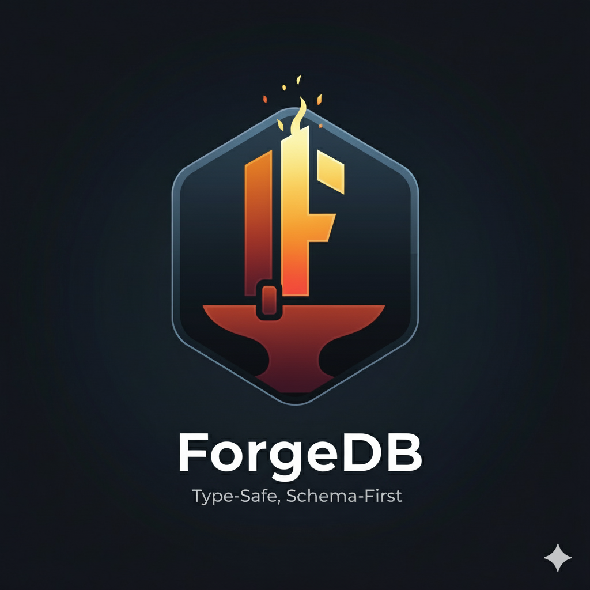

<div align="center">
  
</div>

# ForgeDB - Type-Safe, Schema-First Full-Stack Database Framework

## Executive Summary

ForgeDB is a revolutionary database system that uses a declarative schema language to generate a complete full-stack application: database, type-safe APIs, UI components, and developer tooling. The system transpiles schema definitions into highly optimized Rust code with columnar storage, providing exceptional performance through compile-time optimization while maintaining perfect type safety across the entire stack.

## Core Innovation

**Single Source of Truth**: One schema file defines your entire application:
- Database storage layout (columnar, optimized)
- Type-safe Rust database implementation
- TypeScript types and client SDK
- REST API with OpenAPI specification
- UI component contracts
- Computed field contracts
- Migration system

## Key Features

### Compile-Time Optimization
- Schema transpiles to specialized Rust code
- No runtime overhead from generic data structures
- Monomorphization eliminates indirection
- SIMD-friendly columnar layout for numeric operations

### Columnar Hybrid Storage
- Fixed-size types (u64, f64, uuid, etc.): Memory-mapped pages for zero-copy access
- Variable-length data (strings): Append-only with offset indices
- Inline structs: Deterministic fixed-size compound data
- Optimal cache locality and vectorization

### Type Safety End-to-End
- Schema → Rust types → TypeScript types
- Impossible to have schema drift
- Compile-time verification
- Generated API contracts

### Auto-Generated REST API
- CRUD operations for all models
- Relationship traversal
- Query parameters from schema
- OpenAPI specification
- Type-safe client generation

### Flexible Computed Fields
- Client-side computation (default, zero overhead)
- Server-side plugins (WASM/Lua/Python) when needed
- Language-agnostic contract
- Lazy evaluation

### UI Integration
- Components referenced in schema
- Type-safe props generation
- Server-side rendering support
- Multiple framework support (JSX, HTML, Svelte, Vue)

### Developer Experience
- CLI-driven workflow
- Hot reload on schema changes
- Auto-scaffolding of stubs
- Validation and type checking
- Migration generation

## Target Use Cases

### Perfect For
- Web applications with stable schemas
- Type-safe full-stack development
- Local-first applications (future WASM support)
- Embedded systems with schema known at compile-time
- Microservices with strong contracts
- Rapid prototyping with production-quality output

### Not Ideal For
- Highly dynamic schemas changing at runtime
- Analytics databases requiring ad-hoc queries on unknown schemas
- Systems requiring schema flexibility over performance

## Architecture Overview

```
schema.forge (declarative)
    ↓
Transpiler (parser + code generator)
    ↓
    ├─→ Rust Database Code
    │   ├─ Columnar storage implementation
    │   ├─ Type-safe query API
    │   ├─ REST API server
    │   └─ Migration system
    │
    ├─→ TypeScript Types & SDK
    │   ├─ Model types
    │   ├─ API client
    │   └─ Computed field contracts
    │
    ├─→ OpenAPI Specification
    │
    └─→ Component Stubs
        └─ Type-safe UI components
```

## Performance Characteristics

**Expected Benefits:**
- **Memory efficiency**: Columnar layout reduces memory footprint for sparse access
- **Query performance**: Direct memory access, SIMD operations on numeric columns
- **Zero deserialization**: Memory-mapped fixed-size types
- **Cache-friendly**: Sequential column access patterns
- **Compile-time optimization**: Rust compiler optimizes for specific schema

**Trade-offs:**
- Schema changes require recompilation
- Less flexible than runtime-generic databases
- Larger binary size (specialized code per schema)

## Development Phases

### Phase 1: Core Database
Foundation: storage engine, type system, basic queries, transpiler.

### Phase 2: Full-Stack Integration
Developer experience: CLI, API generation, hot reload, TypeScript SDK.

### Phase 3: AI-Powered Development (experimental)
Future: AI agents implement components from schema annotations.

## Project Structure

```
forgedb/
├── crates/               # 15 focused crates (public + internal)
│   ├── storage/          # Columnar storage engine
│   ├── wal/              # Write-Ahead Log
│   ├── http-server/      # HTTP server infrastructure
│   ├── parser/           # Schema parser
│   └── ...               # See docs/ARCHITECTURE.md
├── docs/                 # Comprehensive documentation
│   ├── ARCHITECTURE.md   # System design
│   ├── PUBLIC_CRATES.md  # Runtime library guide
│   ├── INTERNAL_CRATES.md # Tooling guide
│   ├── CONTRIBUTING.md   # Contribution guidelines
│   ├── DEVELOPMENT.md    # Development setup
│   └── PUBLISHING.md     # Release process
├── cli/                  # Developer tooling (src/main.rs)
├── examples/             # Example applications
└── tests/                # Integration tests
```

## Getting Started

### Build and generate from a schema

```bash
# Clone the repository
git clone https://github.com/hoodiecollin/forgedb
cd forgedb

# Build the workspace
cargo build --workspace

# Generate code from a schema (Rust, TypeScript, API, and stubs).
# `generate` auto-discovers `schema.forge` in the current directory.
cargo run -- generate all --output ./generated

# Explore the generated code
ls ./generated
```

See [examples/component-integration/](./examples/component-integration/) for a schema that
exercises models, relations, indexes, and UI component integration.

### Future: CLI Usage

```bash
# Install CLI (coming soon)
cargo install forgedb

# Create new project
forgedb init my-app
cd my-app

# Define schema
cat > schema.forge << EOF
User {
  id: +uuid
  email: ^&string
  name: string
}
EOF

# Generate and run
forgedb dev
# Server running at http://localhost:3000
# API docs at http://localhost:3000/docs
```

## Philosophy

**Declarative Over Imperative**: Describe what you want, not how to build it.

**Compile-Time Over Runtime**: Catch errors before deployment, optimize for the specific schema.

**Type Safety Everywhere**: From database to UI, types flow through the entire stack.

**Convention Over Configuration**: Sensible defaults, escape hatches when needed.

**Performance By Design**: Architecture enables speed, not bolted on later.

## Related Projects

**Inspiration from:**
- Diesel (Rust ORM with compile-time queries)
- Prisma (Schema-first with excellent DX)
- Apache Arrow (Columnar memory format)
- PostgREST (Automatic API from schema)
- Rails (Convention over configuration)

**Differentiators:**
- Compile-time specialized code generation
- Columnar storage from the start
- Full-stack from a single schema
- Language-agnostic computed fields
- UI component integration

## License

Dual-licensed under either [MIT](./LICENSE-MIT) or [Apache 2.0](./LICENSE-APACHE) at your option.

## Documentation

Comprehensive documentation is available in the [`docs/`](./docs/) directory:

- **[Architecture](./docs/ARCHITECTURE.md)** - System design, component architecture, and design decisions
- **[Public Crates](./docs/PUBLIC_CRATES.md)** - Runtime library guide and API documentation
- **[Internal Crates](./docs/INTERNAL_CRATES.md)** - Tooling and code generation pipeline
- **[Contributing](./docs/CONTRIBUTING.md)** - Contribution guidelines and code of conduct
- **[Development](./docs/DEVELOPMENT.md)** - Development environment setup and workflow
- **[Publishing](./docs/PUBLISHING.md)** - Release process and version management

## Contributing

We welcome contributions! Please read our [Contributing Guide](./docs/CONTRIBUTING.md) to get started.

Key areas where we need help:
- Bug fixes and testing
- Documentation improvements
- Code examples
- Performance optimization

## Contact

- **GitHub Issues**: [Report bugs or request features](https://github.com/hoodiecollin/forgedb/issues)
- **GitHub Discussions**: [Ask questions or share ideas](https://github.com/hoodiecollin/forgedb/discussions)

---

## Status

ForgeDB is in **early development (0.1.x)** and not yet production-ready. The workspace
builds on Rust 2024 (pinned via `rust-toolchain.toml`) with 466 passing tests.

Implemented and working:
- Schema parser (lexer → AST) and validation
- Columnar storage engine, WAL, compaction
- Code generation: Rust database, TypeScript SDK, REST API, React/route stubs
- Migrations, full-text search, query optimization
- HTTP server (axum), FFI for Bun, LSP server + VSCode extension

Known gaps (see [CLAUDE.md](./CLAUDE.md) → Known issues):
- OpenAPI generation is temporarily disabled (lost in a refactor; slated for restore)
- A few non-hermetic integration tests and one stale example need cleanup

Historical per-sprint notes live in [archive/sprint-summaries/](./archive/sprint-summaries/).

---

## Quick Start

```bash
# Run all tests
cargo test --workspace

# Generate all outputs from the schema in the current directory
cargo run -- generate all --output ./generated
```

## Example Schema

```
User {
  id: +uuid                    // Auto-generated primary key
  email: ^&string              // Unique indexed field
  username: ^&string
  display_name: string
  created_at: ^timestamp       // Indexed for range queries
  posts: [Post]                // One-to-many relation
  liked_posts: [Post]          // Many-to-many relation

  // UI components
  profileCard: tsx://components/user/ProfileCard @relations(posts)
  avatar: jsx://components/user/Avatar

  // API routes
  verifyEmail: api://routes/user/verify

  @index(created_at, username) // Composite index
  @pattern(email, "^[a-zA-Z0-9._%+-]+@[a-zA-Z0-9.-]+\\.[a-zA-Z]{2,}$")
}

Post {
  id: +uuid
  title: ^string               // Indexed for search
  content: string
  author: *User                // Required foreign key
  keywords: [string; 10]       // Fixed-size array
  view_count: ^u64             // Indexed for range queries
  tags: [Tag]                  // Many-to-many

  // UI Component with all relations
  detailView: tsx://components/post/DetailView @relations(*)

  @index(author, created_at)
  @min(title, 5)
  @max(title, 200)
}
```

**Generated Query Methods:**
- `find_by_email(email)` - O(1) unique lookup
- `find_by_view_count_range(min, max)` - Range query
- `find_by_view_count_gt(min)` - Greater than
- `find_by_author_and_created_at(id, date)` - Composite index
- `post_tags.add_relation(post_id, tag_id)` - Many-to-many

See [examples/component-integration/](./examples/component-integration/) for a working schema.

---

**Status**: Early development — see [Status](#status) above.
**Version**: 0.1.x
